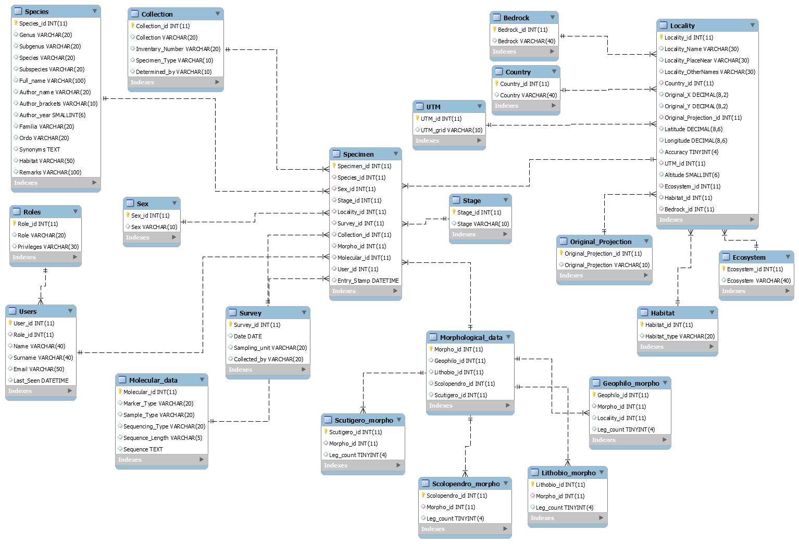

# ChiloBioBase 2.0

In order for this app to work you need installed and configured [MariaDB](https://mariadb.org/ "MariaDB's Homepage") on your computer and a creds.R file with structure displayed below in your working directory.

### creds.R ###

```r
con <- dbConnect(RMariaDB::MariaDB(),  
                 username = "user",  
                 dbname = "database",  
                 password = "password",  
                 host = "00.000.000.00")
```

Current structure of the database is displayed below.   
Plot was made in [MySQL Workbench 6.3 CE](https://dev.mysql.com/downloads/workbench/ "Download MySQL Workbench").
   
